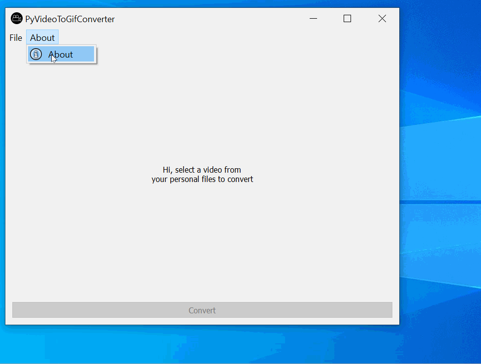

# PyVideoToGifConverter

**PyVideoToGifConverter** is a python GUI that allows selecting a video (.mp4, .mov) to convert into/ create a .gif

## Built With

### Python Modules
* PyQt5
* os
* sys
* imageio
* ffmpeg

## Video Walkthrough

Here's a walkthrough of the GUI:

